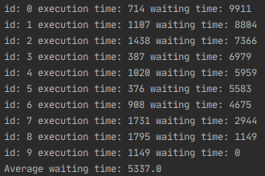
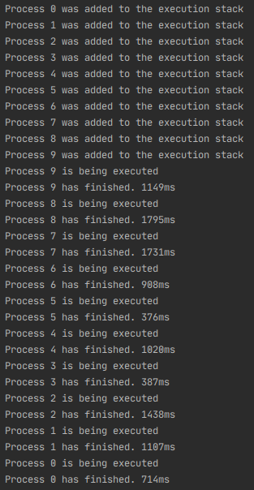

# LIFO Process Manager
# General Info

This is Java implementation of the simplest process manager. Resources are allocated to te process, 
which was added to the execution stack lastly. It has high average waiting time for the processes 
because of the "convoy effect". In case there is a demanding, "big" process in the execution stack,
smaller processes are required to wait until it's finished, which causes increased average waiting time.

This effect can be reduced by prioritizing processed in the execution queue.
       
## Process

For this demonstration, every process has:
- `id` - a basic identifier, which will tell us about the sequence of adding processes to the stack
- `executionTime` - indicates the time required for the process to finish; random for this demonstration
- `waitTime` - stores the waiting time of the process, which is recalculated with every addition to the stack
    
## Methods description       

`public void addProcessToScheduler(Process process)`   
    Pushes a new process to the execution stack and recalculates the waiting time for all the rest processes in stack
 
`public void generateProcesses(int countOfProcesses)`
    Generates a set of processes with random execution time
 
`public double averageWaitingTime()`
    Calculates the average waiting time for processes in the particular execution stack
    
 # Results   
 

